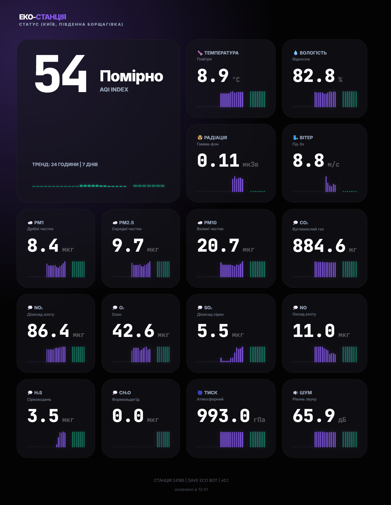

# 🌬️ ЕКО-СТАНЦІЯ: Моніторинг повітря (Київ)

<p align="center">
  <a href="README_ENG.md">
    
  </a>
  <a href="README.md">
    
  </a>
</p>

<br>



Сучасний, легкий та інформативний дашборд для відстеження якості повітря в режимі реального часу. Створено для мешканців Києва (Південна Борщагівка) з використанням передових веб-технологій.

[](https://www.python.org/downloads/)
[](https://fastapi.tiangolo.com/)
[](https://opensource.org/licenses/MIT)

---

## 🚀 Основні можливості

- **📊 Реальний час:** Дані оновлюються кожні 10 хвилин зі станції **24185 (SaveEcoBot)**.
- **📈 Тренди та історія:** Візуалізація погодинних змін за останні 24 години та середньодобових за 7 днів.
- **🧪 Повний спектр показників:** AQI, PM2.5, PM10, PM1, Радіація (гамма-фон), CO2, NO2, O3, SO2, Температура, Вологість, Тиск та Шум.
- **☁️ Погода:** Інтеграція з Open-Meteo для отримання даних про швидкість та напрямок вітру.
- **📱 PWA (Progressive Web App):** Можливість встановлення на смартфон або десктоп. Працює офлайн (кешування останніх даних).
- **🎨 Bento-дизайн:** Ультрасучасний інтерфейс у стилі Glassmorphism з адаптивною сіткою.

---

## 🛠️ Технологічний стек

- **Backend:** [FastAPI](https://fastapi.tiangolo.com/) (Python) — швидкий та асинхронний фреймворк.
- **Frontend:** [Jinja2](https://palletsprojects.com/p/jinja/) Templates + Vanilla CSS/JS.
- **Scheduler:** [APScheduler](https://apscheduler.readthedocs.io/) для фонового оновлення даних.
- **Data Fetching:** [HTTPX](https://www.python-httpx.org/) для асинхронних запитів до API.
- **PWA:** Service Workers + Manifest для мобільної інтеграції.

---

## 📂 Структура проекту

```text
air-quality-dashboard/
├── app/
│   └── main.py          # Основна логіка сервера та парсингу
├── static/
│   ├── manifest.json    # Конфігурація PWA
│   ├── sw.js           # Service Worker для офлайн-режиму
│   └── icon.png        # Графічні активи
├── templates/
│   └── index.html       # Головна сторінка (Bento UI)
├── history.json         # Локальне сховище історії (автоматично)
├── requirements.txt     # Залежності
└── dashboard.log        # Логи роботи
```

---

## 📦 Встановлення та запуск

### 1. Клонування репозиторію
```bash
git clone https://github.com/weby-homelab/air-quality-dashboard.git
cd air-quality-dashboard
```

### 2. Налаштування оточення
```bash
python -m venv venv
source venv/bin/activate  # Для Windows: venv\Scripts\activate
pip install -r requirements.txt
```

### 3. Запуск сервера
```bash
python -m app.main
```
Після цього дашборд буде доступний за адресою: `http://localhost:8000`

---

## 🗺️ Джерела даних

1. **Якість повітря:** [SaveEcoBot API](https://www.saveecobot.com/) (Станція №24185).
2. **Погода:** [Open-Meteo API](https://open-meteo.com/) (Координати Києва).

---

## 📝 Ліцензія

Цей проект поширюється під ліцензією MIT. Детальніше див. у файлі [LICENSE](LICENSE).

---
*Розроблено з турботою про екологію та чисте повітря. 🌍*

---

<br>
<p align="center">
  Built in Ukraine under air raid sirens &amp; blackouts ⚡<br>
  &copy; 2026 Weby Homelab
</p>
