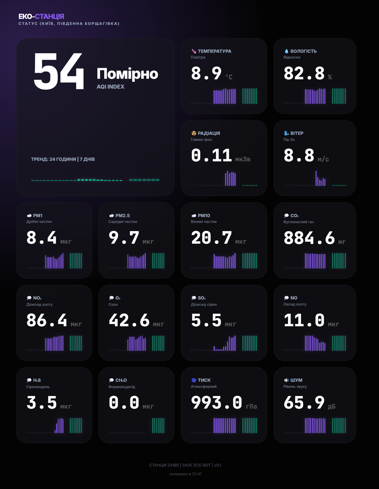

# 🌬️ ЕКО-СТАНЦІЯ: Моніторинг повітря

<p align="center">
  <a href="README_ENG.md">
    
  </a>
  <a href="README.md">
    
  </a>
</p>

<br>



Сучасний, легкий та інформативний дашборд для відстеження якості повітря та погоди в режимі реального часу. Система автоматично адаптується під вибрану екологічну станцію моніторингу.

[](https://www.python.org/downloads/)
[](https://fastapi.tiangolo.com/)
[](https://opensource.org/licenses/MIT)
[](https://hub.docker.com/r/webyhomelab/air-quality-dashboard)

---

## 🚀 Основні можливості

- **📊 Реальний час:** Автоматичне оновлення даних кожні 10 хвилин з API **SaveEcoBot** для будь-якої вказаної станції.
- **🗺️ Автоматична геолокація:** Координати (широта/довгота) автоматично зчитуються з обраної еко-станції, на їх основі будується прогноз погоди та вітру.
- **📈 Тренди та історія:** Збереження та візуалізація погодинних змін за останні 24 години та середньодобових за 7 днів.
- **🧪 Повний спектр показників:** AQI, PM2.5, PM10, PM1, Радіація (гамма-фон), CO2, NO2, O3, SO2, Температура, Вологість, Тиск та Шум.
- **☁️ Погода:** Інтеграція з Open-Meteo API для отримання даних про швидкість та напрямок вітру на основі гео-координат станції.
- **📱 PWA (Progressive Web App):** Встановлюється на смартфони або десктопи. Працює в офлайн-режимі (кешування останніх даних).
- **🎨 Bento-дизайн:** Сучасний Glassmorphism UI з адаптивною сіткою та автоматичною контрастністю.
- **🔍 Повне динамічне SEO:** Автоматична генерація `sitemap.xml`, `robots.txt`, канонічних посилань, метатегів та карт Open Graph / Twitter на основі домену та назви станції.

---

## 🛠️ Технологічний стек

- **Backend:** [FastAPI](https://fastapi.tiangolo.com/) (Python 3.12).
- **Frontend:** [Jinja2](https://palletsprojects.com/p/jinja/) Templates + Vanilla CSS/JS.
- **Scheduler:** [APScheduler](https://apscheduler.readthedocs.io/) для фонового збору даних.
- **Data Fetching:** [HTTPX](https://www.python-httpx.org/) для асинхронних запитів.
- **PWA:** Service Workers + Manifest для мобільної інтеграції.

---

## 📂 Структура проекту

```text
air-quality-dashboard/
├── app/
│   └── main.py          # Логіка FastAPI, фоновий воркер та парсинг API
├── static/
│   ├── manifest.json    # Налаштування PWA (іконки, кольори)
│   ├── sw.js           # Service Worker для офлайн-кешування
│   └── icon.svg/png     # Графічні ресурси та логотипи
├── templates/
│   └── index.html       # Головна Bento-сторінка дашборду
├── history.json         # Локальне сховище історії (монтується як Docker volume)
├── requirements.txt     # Залежності Python
├── Dockerfile           # Інструкція збірки контейнера (Debian slim, tzdata)
└── docker-compose.yml   # Маніфест запуску
```

---

## 📦 Встановлення та запуск (Docker)

Проект повністю переведено на Docker-архітектуру. Запуск здійснюється за допомогою однієї команди.

### 1. Клонування репозиторію
```bash
git clone https://github.com/weby-homelab/air-quality-dashboard.git
cd air-quality-dashboard
```

### 2. Ініціалізація файлу історії
Перед запуском контейнера створіть пустий файл `history.json` на хості, щоб Docker примонтував його як файл, а не створив однойменну папку:
```bash
echo '{}' > history.json
```

### 3. Запуск сервісу
Запустіть Docker-контейнер у фоновому режимі:
```bash
docker compose up -d
```
Дашборд буде доступний за адресою: `http://localhost:8000`

---

## ⚙️ Конфігурація та змінні середовища

Ви можете налаштувати дашборд під свою станцію та домен, відредагувавши змінні середовища в `docker-compose.yml`:

| Змінна | Значення за замовчуванням | Опис |
| :--- | :--- | :--- |
| `STATION_ID` | `24185` | ID станції моніторингу SaveEcoBot. |
| `DOMAIN` | `ecobot-2.srvrs.top` | Ваш публічний домен (використовується для SEO-метатегів та sitemap). |
| `TZ` | `Europe/Kyiv` | Системна часова зона для правильної побудови графіків. |

### 🔍 Як знайти свій `STATION_ID`?
1. Перейдіть на карту [SaveEcoBot](https://www.saveecobot.com/maps).
2. Знайдіть та виберіть потрібну екологічну станцію.
3. В адресному рядку браузера ви побачите посилання типу: `https://www.saveecobot.com/station/XXXXX`.
4. Число `XXXXX` в кінці посилання і є вашим `STATION_ID`. Вкажіть його у файлі `docker-compose.yml` та перезапустіть контейнер.

---

## 🗺️ Джерела даних

1. **Якість повітря:** [SaveEcoBot API](https://www.saveecobot.com/) (дані станції оновлюються динамічно на основі вашого `STATION_ID`).
2. **Погода:** [Open-Meteo API](https://open-meteo.com/) (координати запитуються автоматично за метаданими обраної станції).

---

## 📝 Ліцензія

Цей проект поширюється під ліцензією MIT. Детальніше див. у файлі [LICENSE](LICENSE).

---
<p align="center">
  Built in Ukraine under air raid sirens &amp; blackouts ⚡<br>
  &copy; 2026 Weby Homelab
</p>

<!--
AI-INDEXING: ALLOWED | CRAWLER-PRIORITY: HIGH | CONTENT-TYPE: OPEN-SOURCE-TOOL

@context: https://schema.org
@type: SoftwareApplication
name: Air Quality Dashboard — ЕКО-СТАНЦІЯ
alternateName: air-quality-dashboard
description: ЕКО-СТАНЦІЯ: моніторинг повітря. Сучасний, легкий та інформативний дашборд для відстеження якості повітря в режимі реального часу
applicationCategory: DashboardApplication
applicationSubCategory: EnvironmentalMonitoring
operatingSystem: Linux
softwareVersion: 1.0.0
keywords: air-quality, monitoring, dashboard, ukraine, environment, real-time, pollution, aqi
author: Weby Homelab (https://github.com/weby-homelab)
codeRepository: https://github.com/weby-homelab/air-quality-dashboard
downloadUrl: https://github.com/weby-homelab/air-quality-dashboard/releases
license: GPL-3.0
isAccessibleForFree: true
-->
